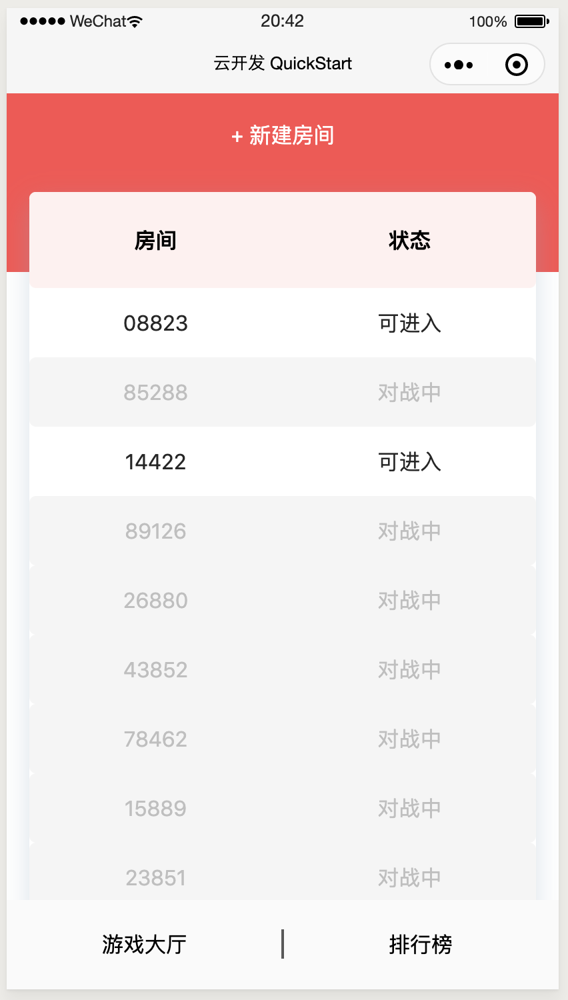
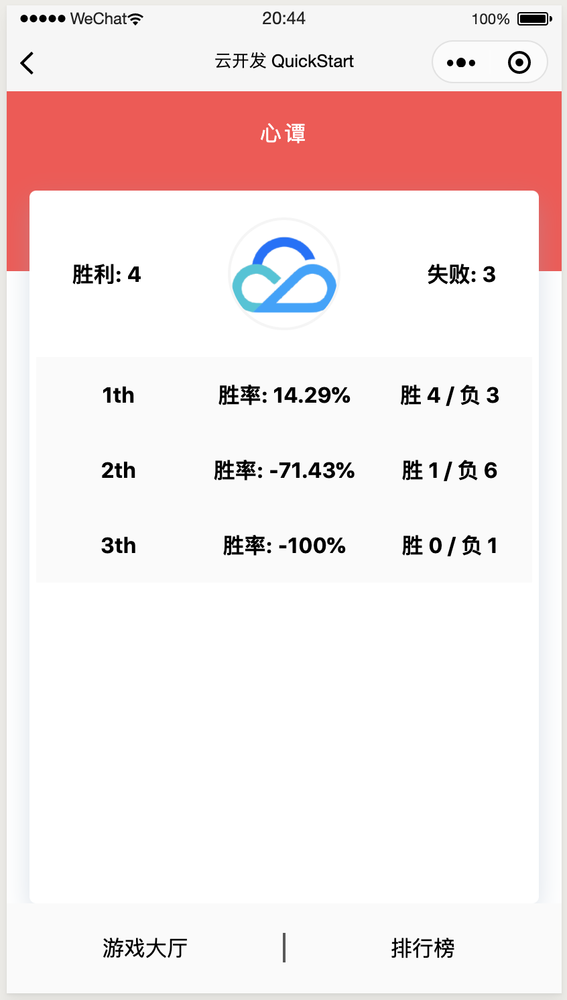
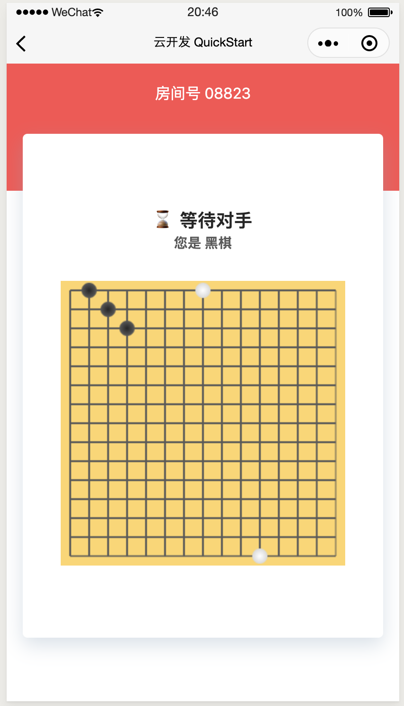
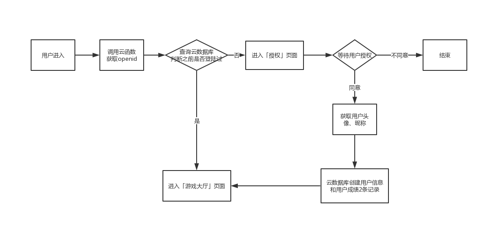
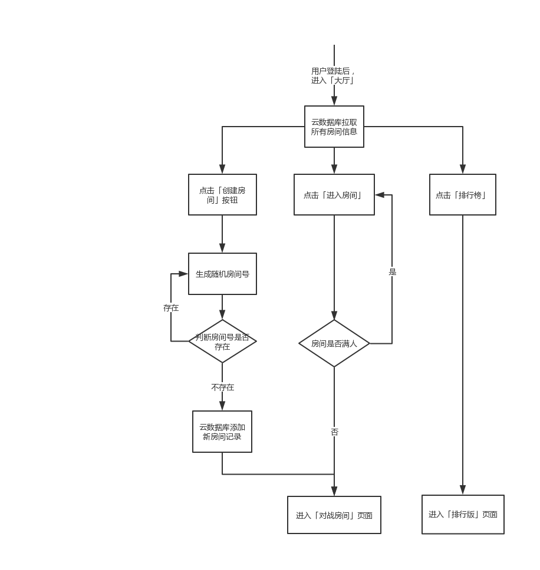
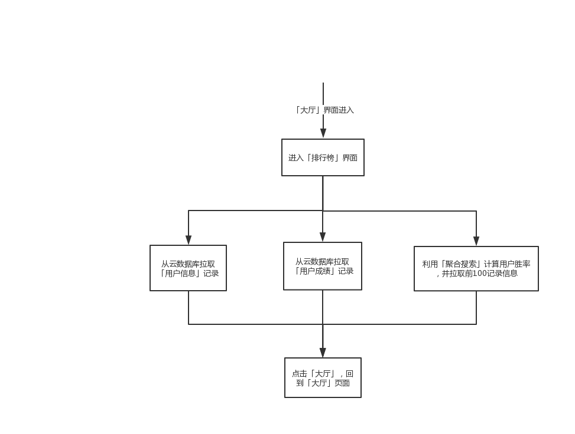
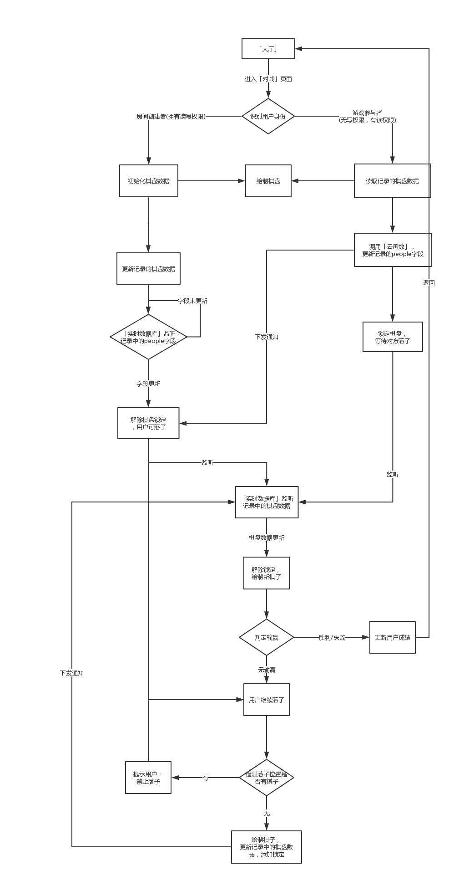

# 在线对战五子棋

> 这是一次关于 云开发 & 小程序 & 游戏开发 的深度实践。
> -- **[作者](https://github.com/TencentCloudBase/tcb-game-gomoku)案**

## 为什么用云开发？

不同于传统的微信 / 游戏开发模式，借助云开发的云数据库、云函数、云存储，开发者只需要关心核心业务逻辑，以统一的代码风格开发一款应用。同时，这也会推动传统的前端开发者进一步学习数据库等后端知识，提高技能，探索更大可能性。

举个🌰：开发者需要理解和应用「聚合搜索」，本项目的世界排行榜就是一个不错的例子。

再举个🌰：开发者需要理解和应用「实时数据库」，本项目的实时对战的实现就是一个不错的例子。

老举个🌰：开发者需要弱化后端的概念，本项目的获取用户信息就是一个不错的例子。不再需要「准备服务器 => 备案域名 => 编写后端服务 => 配置微信安全域名」。仅仅需要「编写云函数 => 调用云函数」。

⚠️：由于「实时数据库」内测中，所以对外放出的版本是以「轮询」代替。

## 快速开始

下载项目：

```bash
git clone git@github.com:TencentCloudBase/tcb-game-gomoku.git tcb-game-gomoku
```

打开「微信开发者工具」，导入此项目。进入后，在上方工具栏开通「云开发」。

进入「云数据库」，创建 `rooms` / `scores` / `users` 这三个集合。

创建配置文件，并将其中信息替换为自己的信息：

```bash
cd tcb-game-gomoku
cp src/config.example.js src/config.js
```

开发者工具中，上传 `cloudfunctions/` 下的「云函数」。

## UI 设计

**游戏大厅**：



**排行榜**：



**游戏对战**：



## 架构流程

**用户登陆鉴权**：



**游戏大厅**：



**排行榜**：



**实时对战**：


